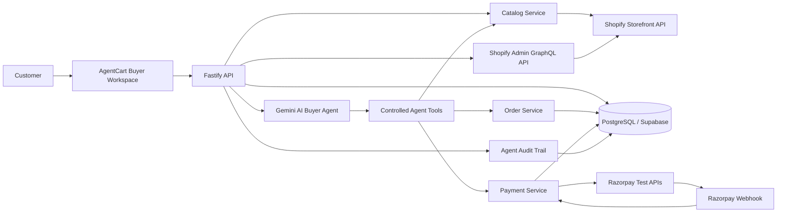
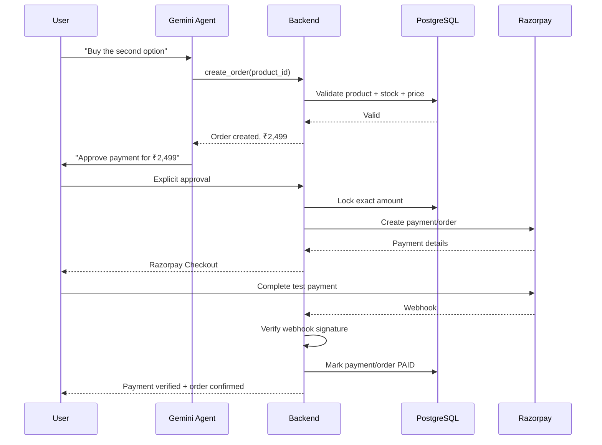
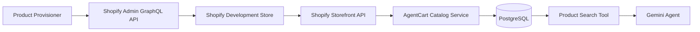
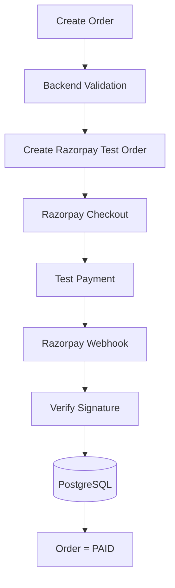
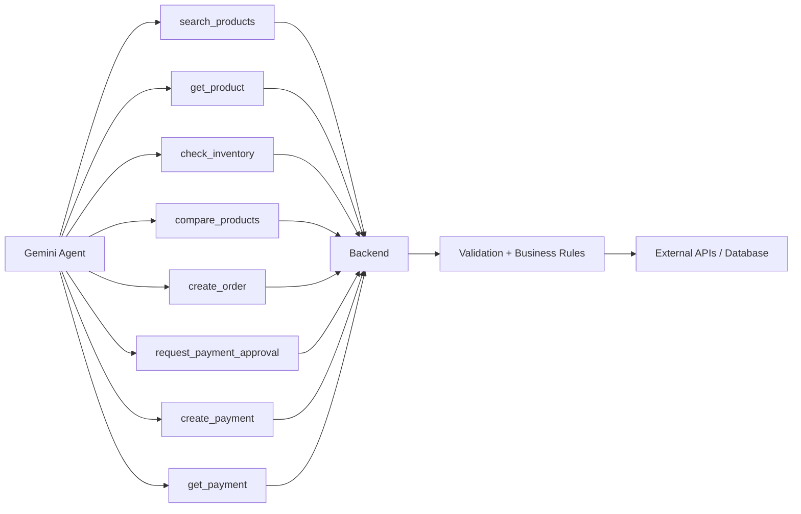
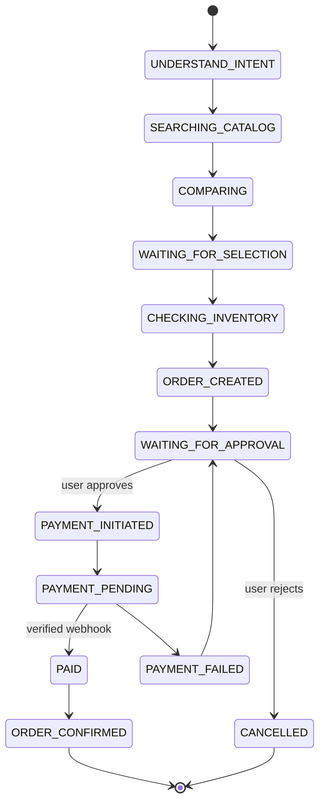
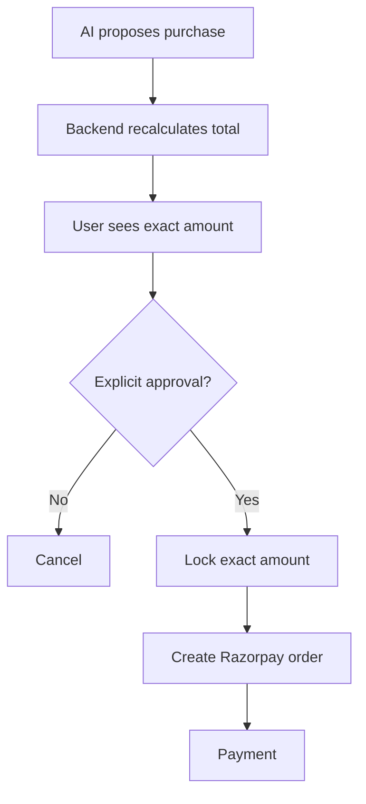
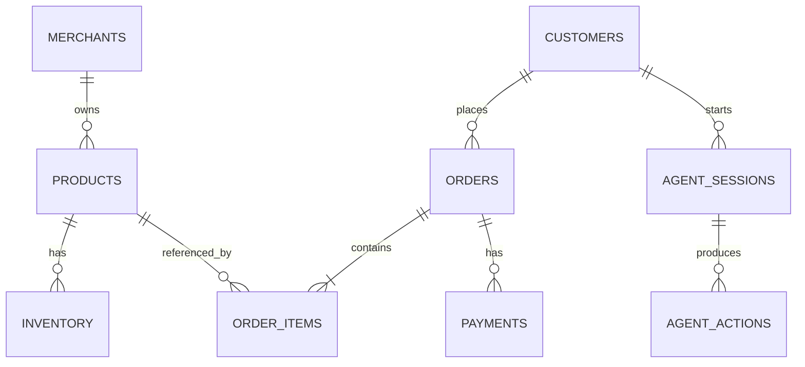
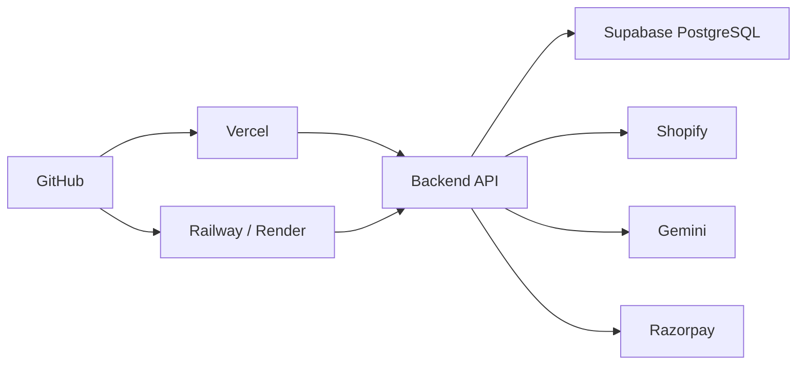

# AgentCart — Final Architecture Specification
## Razorpay AI Builder Internship 2026 — Track 1: AI Growth & Agentic Commerce

> **Core product:** AgentCart — AI Buyer Infrastructure  
> **Positioning:** “An AI that can actually buy from a merchant.”
>
> This document is the architecture specification to give to Antigravity. It defines the system boundaries, real integrations, agent tools, safety model, data flow, frontend information architecture, and deployment structure.

---

## 1. Product Goal

Build an AI buyer that can take a natural-language shopping request and complete a real commerce journey:

**Natural-language intent → real merchant catalog → product discovery → comparison → user decision → order creation → explicit payment approval → Razorpay Test payment → webhook verification → confirmed order**

The product must **not** be a generic AI chat application.

The chat is only the natural-language control surface. The primary interface is an **AI-native commerce workspace** showing products, decisions, order state, payment state, and agent actions.

---

# 2. System Architecture



### Core rule

**Gemini never directly controls money.**

Gemini can request an action through a tool. The backend validates the action and performs the external API operation.



---

# 3. Technology Stack

| Layer | Technology |
|---|---|
| Frontend | Next.js 16 + React + TypeScript |
| Styling | Tailwind CSS |
| UI Components | shadcn/ui |
| Backend | Fastify + TypeScript |
| Database | PostgreSQL |
| ORM | Prisma |
| DB Hosting | Supabase |
| AI | Gemini API |
| Agent | Gemini Function Calling |
| Product API | Shopify Storefront API |
| Payments | Razorpay Test APIs |
| Webhooks | Razorpay Webhooks |
| Charts | Recharts |
| Validation | Zod |
| Frontend Deployment | Vercel |
| Backend Deployment | Railway or Render |
| Version Control | GitHub |
| Development | Antigravity |

### Keep the architecture simple

Use a **modular monolith**.

Do not introduce Redis, Kafka, Kubernetes, microservices, Docker orchestration, LangChain, multiple AI models, a vector database, or complex authentication unless a concrete requirement appears.

---

# 4. Real External Integrations

## 4.1 Shopify — Product Source + Automatic Product Provisioning

Use a **real Shopify development store**.

Shopify is the merchant/catalog system. AgentCart has two server-side Shopify paths:

1. **Storefront API** — read the buyer-facing catalog.
2. **Admin GraphQL API** — provision/update the hackathon demo catalog and synchronize it into AgentCart.

The Admin API is used only by backend/admin provisioning code. Gemini never receives Shopify Admin credentials and never creates products itself.

The application should obtain:

- Products
- Variants
- Prices
- Availability
- Images
- Descriptions
- Product metadata



### Automatic demo catalog provisioning

AgentCart must be able to create its own deterministic demo products in the Shopify development store after the environment is configured. This removes manual product-entry work for the hackathon demo.

Use a dedicated marker tag such as `agentcart-demo` so provisioning is idempotent:

```text
POST /catalog/seed
        ↓
Query Shopify for agentcart-demo products
        ↓
Existing? ── yes → reuse + sync
        │
        no
        ↓
Create deterministic demo products through Admin GraphQL
        ↓
Fetch created products/variants
        ↓
Sync normalized catalog into PostgreSQL
```

The seed operation must never create duplicate products when run repeatedly. It should create missing products only, then synchronize the resulting Shopify catalog.

Suggested demo categories remain:

- Headphones
- Keyboards
- Smartwatches
- Backpacks
- Speakers
- Accessories

Products may use deterministic test data, but they must become real Shopify products and then be read back through the real catalog integration.

Do not make the AI invent products.

The agent must reason only over catalog results returned by the application.

---

## 4.2 Razorpay — Payment Layer

Use **Razorpay Test Mode**.



Never implement payment success by changing a local status manually.

Do not allow the model to mark a payment successful.

Only a verified Razorpay response/webhook can transition the payment to a successful state.

---

# 5. Backend Responsibility

The backend is authoritative for:

- Product identity
- Product price
- Inventory
- Merchant identity
- Order state
- Payment amount
- Payment state
- User approval
- Webhook verification
- Agent audit records

The LLM is responsible for:

- Understanding natural language
- Selecting tools
- Comparing valid catalog results
- Explaining recommendations
- Orchestrating the shopping journey

---

# 6. Agent Tool Architecture

Give the Gemini agent controlled tools.

## Catalog tools

```text
search_products()
get_product()
check_inventory()
compare_products()
```

## Order tools

```text
create_order()
get_order()
cancel_order()
```

## Payment tools

```text
request_payment_approval()
create_payment()
get_payment()
```

### Tool boundary



---

# 7. Agent State Machine

The agent should operate through explicit commerce states.



This makes the system deterministic and debuggable instead of allowing an unconstrained LLM loop.

---

# 8. Safety and Money Controls

## Hard rules

The AI cannot:

- Change product price
- Invent inventory
- Choose an arbitrary merchant
- Directly mark payment successful
- Spend money without explicit user approval

## Backend validation

At minimum:

```text
product exists
stock available
price unchanged
merchant correct
amount within configured limit
user approval exists
```

Example limit:

```text
MAX_ORDER_VALUE = ₹5,000
```

The exact amount must be locked after approval and before the Razorpay payment is created.



---

# 9. Audit Trail

Every meaningful agent action should be persisted.

Suggested table:

```text
agent_actions

id
session_id
timestamp
tool
input
output
decision
status
```

Example trace:

```text
✓ Understood shopping intent
  "ANC headphones < ₹3,000"

✓ Queried merchant catalog
  42 products → 6 matches

✓ Checked inventory
  4 available

✓ Compared products
  Battery + ANC + price

→ Selected product

⚠ Waiting for user approval

✓ Order created
✓ Razorpay payment initiated
✓ Payment captured
✓ Webhook verified
✓ Merchant order updated
```

The UI should expose this as an **Agent Trace**, not a fake “AI is thinking” animation.

---

# 10. Database Architecture

Use PostgreSQL + Prisma.

## Core tables

```text
merchants
products
inventory
customers
orders
order_items
payments
agent_sessions
agent_actions
```

## Relationship model



The database should be the application's source of truth for order/payment state after external events have been verified.

---

# 11. Frontend Architecture — Non-Generic Design

## Design direction

Do **not** build:

> ChatGPT clone + product cards + checkout button.

Build an **AI-native commerce workspace**.

The visual language should be:

- Premium
- Dense but readable
- Commerce-oriented
- Data-rich
- Calm
- Minimal
- Clear hierarchy
- Strong typography
- Real product photography
- Subtle motion only where it communicates state

Avoid:

- Giant gradients
- Excessive glassmorphism
- Neon AI aesthetics
- “AI MAGIC” labels everywhere
- Floating chatbot bubbles
- Fake typing/thinking animations
- Generic SaaS dashboard cards

---

# 12. Buyer Workspace — Final UI Concept

The buyer experience should be **product-first**, with conversation integrated into the workspace.

```text
┌──────────────────────────────────────────────────────────────────────┐
│ AGENTCART                         SHOP                         ● LIVE │
├───────────────┬─────────────────────────────────────┬────────────────┤
│               │                                     │                │
│ YOUR REQUEST  │         PRODUCT DISCOVERY            │ YOUR CART      │
│               │                                     │                │
│ “ANC           │  6 matches                          │  Sony WH-520   │
│ headphones     │                                     │  ₹2,499        │
│ under ₹3k      │  ┌─────────┐  ┌─────────┐          │                │
│ for flights”   │  │ PRODUCT │  │ PRODUCT │          │  Qty 1         │
│               │  │ image   │  │ image   │          │                │
│               │  │         │  │         │          │  Total         │
│ AGENT          │  │ ₹2,499  │  │ ₹2,799  │          │  ₹2,499        │
│               │  │ 40h     │  │ 50h     │          │                │
│ Found 6       │  │ ANC ✓   │  │ ANC ✓   │          │  [ REVIEW ]    │
│ products.     │  └─────────┘  └─────────┘          │                │
│               │                                     │                │
│ “I recommend  │  WHY THIS ONE                       │                │
│ #2 because…” │  Battery · ANC · price              │                │
│               │                                     │                │
├───────────────┴─────────────────────────────────────┴────────────────┤
│ AGENT TRACE  ▾   Catalog ✓   Inventory ✓   Selection ✓   Approval ○ │
└──────────────────────────────────────────────────────────────────────┘
```

### Important

The **conversation is not the dominant panel**.

The product workspace is dominant.

The user should always understand:

1. What they asked for
2. What the agent found
3. Why the agent recommends something
4. What they selected
5. How much it costs
6. What happens next

---

# 13. Product Detail Interaction

When the user selects a product, open a focused product detail view rather than sending them to a generic page.

Show:

```text
PRODUCT

[Large product image]

Sony WH-520
₹2,499

40h battery
ANC
Bluetooth 5.2
180g

WHY AGENT RECOMMENDS IT

✓ Under your ₹3,000 budget
✓ Highest battery among shortlisted products
✓ ANC matches your flight requirement

INVENTORY
18 available

[ SELECT ]
```

The explanation must be generated from actual product attributes returned by the catalog.

---

# 14. Purchase Approval

The payment approval screen should be extremely clear.

```text
┌──────────────────────────────────────────┐
│          REVIEW PURCHASE                 │
│                                          │
│  Sony WH-520                             │
│  Quantity                         1      │
│                                          │
│  Item                           ₹2,499   │
│  Total                          ₹2,499   │
│                                          │
│  Payment will be processed by Razorpay   │
│                                          │
│  [ CANCEL ]       [ APPROVE ₹2,499 ]     │
└──────────────────────────────────────────┘
```

No ambiguous buttons like:

> “Continue”

Use the exact action and amount.

---

# 15. Agent Trace UI

Make the trace compact and useful.

```text
AGENT TRACE

09:41:02  INTENT
          Budget ₹3,000 · ANC · long flights

09:41:03  CATALOG
          Shopify → 42 products searched

09:41:04  FILTER
          6 products match

09:41:05  INVENTORY
          4 currently available

09:41:06  DECISION
          Product #2 selected
          Reason: battery + ANC + price

09:41:18  ORDER
          Order created · ₹2,499

09:41:21  APPROVAL
          Waiting for user

09:41:31  PAYMENT
          Razorpay payment initiated

09:41:46  WEBHOOK
          Signature verified

09:41:47  COMPLETE
          Order confirmed
```

---

# 16. Merchant Console

Separate merchant experience.

Do not make it another AI chat.

## Overview

```text
┌─────────────────────────────────────────────────────────────────┐
│ AGENTCART MERCHANT                               STORE ONLINE ● │
├──────────────┬──────────────────────────────────────────────────┤
│              │                                                  │
│ Overview     │ AI-ASSISTED COMMERCE                             │
│ Products     │                                                  │
│ Orders       │ ₹4,82,390                                       │
│ Agent Runs   │ AI-attributed revenue                            │
│ Analytics    │                                                  │
│              │ ┌────────────┐ ┌────────────┐ ┌──────────────┐ │
│              │ │84 ORDERS   │ │8.7%        │ │₹2,184        │ │
│              │ │AI ASSISTED │ │CONVERSION  │ │AVG ORDER     │ │
│              │ └────────────┘ └────────────┘ └──────────────┘ │
│              │                                                  │
│              │ AGENT FUNNEL                                     │
│              │ Discovery → Comparison → Checkout → Purchase    │
│              │                                                  │
│              │ 341          126          94          84        │
│              │                                                  │
└──────────────┴──────────────────────────────────────────────────┘
```

The merchant dashboard connects the AI buyer to the **Growth** side of Track 1.

---

# 17. API Structure

Suggested backend endpoints:

```text
GET    /health

GET    /catalog/products
GET    /catalog/products/:id
POST   /catalog/sync
POST   /catalog/seed

POST   /agent/session
POST   /agent/message
GET    /agent/session/:id
GET    /agent/session/:id/actions

POST   /orders
GET    /orders/:id
POST   /orders/:id/cancel

POST   /payments/create
GET    /payments/:id
POST   /webhooks/razorpay

GET    /merchant/dashboard
GET    /merchant/orders
GET    /merchant/analytics
```

Validate all request/response boundaries with Zod.

---

# 18. Project Structure

```text
agentcart/
├── apps/
│   ├── web/
│   │   ├── app/
│   │   ├── components/
│   │   ├── lib/
│   │   └── styles/
│   │
│   └── api/
│       └── src/
│           ├── agent/
│           │   ├── agent.ts
│           │   ├── tools.ts
│           │   ├── prompts.ts
│           │   └── policies.ts
│           │
│           ├── catalog/
│           │   ├── shopify.ts
│           │   └── catalog.service.ts
│           │
│           ├── orders/
│           │   └── order.service.ts
│           │
│           ├── payments/
│           │   ├── razorpay.ts
│           │   └── webhook.ts
│           │
│           ├── database/
│           │   └── prisma.ts
│           │
│           └── server.ts
│
├── prisma/
│   └── schema.prisma
│
├── scripts/
│   └── seed-shopify.ts
├── README.md
└── .env.example
```

---

# 19. Environment Variables

The user provides the real values locally/deployed. Never commit `.env`.

```text
GEMINI_API_KEY=

SHOPIFY_STORE_DOMAIN=
SHOPIFY_STOREFRONT_ACCESS_TOKEN=
SHOPIFY_ADMIN_ACCESS_TOKEN=
SHOPIFY_API_VERSION=2026-07

RAZORPAY_KEY_ID=
RAZORPAY_KEY_SECRET=
RAZORPAY_WEBHOOK_SECRET=

DATABASE_URL=

MAX_ORDER_VALUE=5000
```

### What each credential does

- `GEMINI_API_KEY`: server-side Gemini function-calling access.
- `SHOPIFY_STORE_DOMAIN`: Shopify store host used by both Shopify clients.
- `SHOPIFY_STOREFRONT_ACCESS_TOKEN`: server-side Storefront API access for catalog reads.
- `SHOPIFY_ADMIN_ACCESS_TOKEN`: server-side Admin GraphQL access for product provisioning/sync operations.
- `SHOPIFY_API_VERSION`: pinned Shopify API version; use `2026-07` for this build.
- `RAZORPAY_KEY_ID`: public identifier used when initializing Razorpay checkout/payment flow.
- `RAZORPAY_KEY_SECRET`: server-only Razorpay API credential.
- `RAZORPAY_WEBHOOK_SECRET`: server-only webhook signature verification secret.
- `DATABASE_URL`: PostgreSQL/Supabase connection.
- `MAX_ORDER_VALUE`: backend safety limit for an order.

Never expose server secrets to the browser or Gemini.

Never expose secrets in the frontend.

---

# 20. Shopify Provisioning Boundary

The implementation should separate Shopify responsibilities into small modules:

```text
shopify-admin.ts
    ↓
Raw authenticated Admin GraphQL requests

product-seeder.ts
    ↓
Deterministic demo catalog creation + idempotency

shopify-storefront.ts
    ↓
Buyer-facing catalog reads

catalog.service.ts
    ↓
Normalization + PostgreSQL catalog access

catalog.routes.ts
    ↓
HTTP endpoints /catalog/seed and /catalog/sync
```

### Important rule

The Storefront API is the buyer catalog path. The Admin API exists because the application has permission to provision the hackathon catalog automatically. Do not give the Admin token to the browser or agent tools.

### Seed data

Keep the demo catalog definition in `product-seeder.ts` as deterministic configuration. Do not put product recommendations into the Gemini prompt. Gemini must discover whatever products actually exist in the synchronized catalog.

### Idempotency marker

Use `agentcart-demo` as a product tag. The seeder must query Shopify before creating products and reuse existing matching products.

---

# 20. Deployment



The frontend can be deployed on Vercel and the Fastify backend on Railway/Render.

---

# 21. Non-Negotiable Engineering Requirements

1. Real Shopify catalog data.
2. Real Razorpay Test Mode transaction.
3. Verified Razorpay webhook.
4. Explicit payment approval.
5. Backend-controlled payment amount.
6. Agent tool calling.
7. Persistent agent trace.
8. Deterministic order/payment state transitions.
9. Proper error handling.
10. No fake success states.
11. No fabricated product attributes.
12. No LLM-controlled payment secrets.
13. Shopify demo products can be provisioned automatically by the backend.
14. Shopify provisioning is idempotent and never creates duplicates on repeat runs.
15. Storefront and Admin credentials remain server-side.
16. Agent searches the normalized real catalog, not a hardcoded recommendation list.
