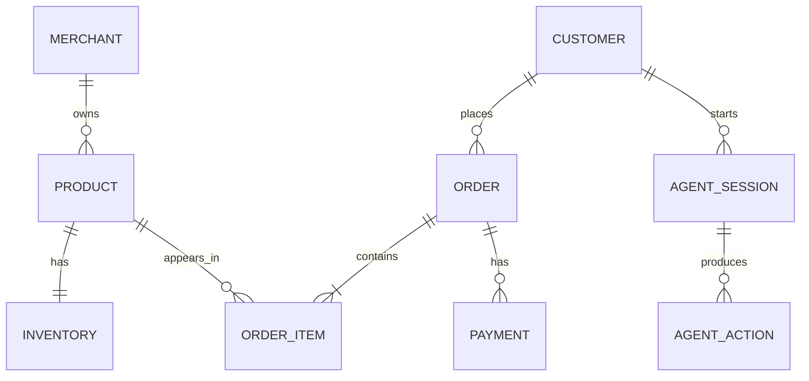
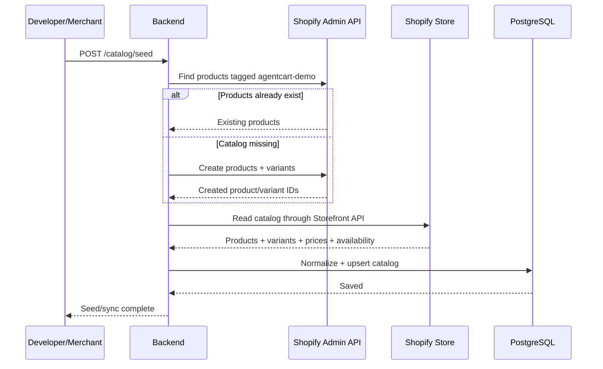
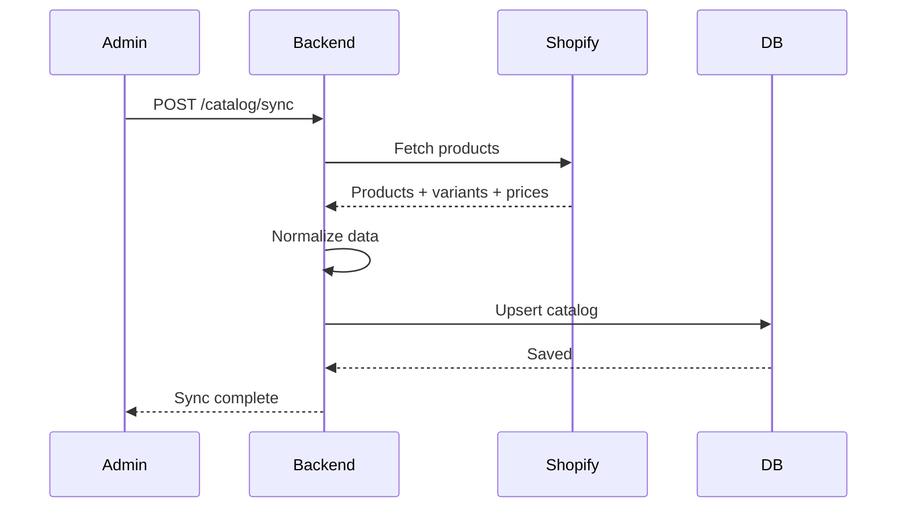
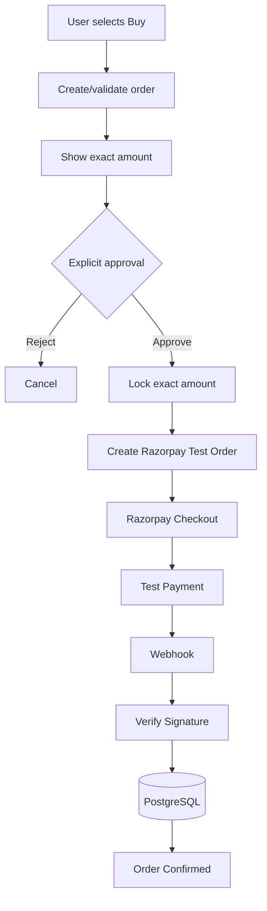
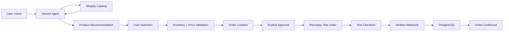

# AgentCart — Final Antigravity Implementation Plan
## Razorpay AI Builder Internship 2026 — Track 1: AI Growth & Agentic Commerce

> **Build target:** A genuinely working AI buyer that can discover real merchant products through Shopify and complete a real Razorpay Test Mode payment after explicit user approval.
>
> **Development environment:** Antigravity
>
> **Do not build a generic AI chatbot. Do not fake transactions. Do not fake product data.**

---

# 1. Final Product Definition

## Name

**AgentCart**

## One-line description

**An AI buyer that can actually buy from a merchant.**

## Core problem

AI assistants can recommend products, but the user usually still has to leave the AI experience, browse a merchant storefront, choose a product, go through checkout, and pay manually.

AgentCart makes the AI the **commerce control layer**:

```text
User intent
    ↓
AI understands intent
    ↓
Searches real merchant catalog
    ↓
Compares actual products
    ↓
Recommends based on requirements
    ↓
User selects product
    ↓
Agent checks inventory
    ↓
Order created
    ↓
Exact amount shown
    ↓
User explicitly approves payment
    ↓
Razorpay Test payment
    ↓
Webhook verification
    ↓
Order confirmed
```

---

# 2. Why This Fits Track 1

Track 1 is **AI Growth & Agentic Commerce**.

AgentCart directly demonstrates:

- AI-led product discovery
- AI-led product comparison
- AI-assisted purchase decisions
- Agentic checkout
- Merchant transacting through an AI buyer
- Razorpay-powered payment
- Observable commerce actions

The strongest positioning is:

> **“The AI didn't just recommend a product. It completed the commerce journey.”**

---

# 3. Build Philosophy

## Must be real

Use:

- Real Shopify Storefront API
- Real Shopify development store/catalog
- Real Razorpay Test Mode API
- Real Razorpay webhook
- Real database
- Real Gemini tool calling

## Must not be fake

Do not:

- Hardcode product recommendations
- Pretend a payment succeeded
- Change `payment.status` manually to success
- Make Gemini invent products
- Generate fake inventory
- Simulate webhook success in the primary demo
- Build a fake checkout screen that only looks like Razorpay

A deterministic test dataset is fine for your **Shopify development store**. The point is that the application retrieves it through a real API and performs real test transactions.

---

# 4. Stack — Lock This Before Coding

```text
Frontend:
Next.js 16
React
TypeScript
Tailwind CSS
shadcn/ui
Recharts

Backend:
Fastify
TypeScript
Zod

Data:
PostgreSQL
Prisma
Supabase

AI:
Gemini API
Gemini Function Calling

Commerce:
Shopify Storefront API

Payments:
Razorpay Test APIs
Razorpay Webhooks

Deployment:
Vercel
Railway or Render

Development:
Antigravity

Version control:
GitHub
```

Do not add additional infrastructure unless a concrete requirement appears.

---

# 5. Requirements Checklist

## Accounts

```text
[ ] GitHub
[ ] Google AI Studio / Gemini API
[ ] Shopify Partner account
[ ] Shopify development store
[ ] Razorpay account
[ ] Razorpay Test Mode
[ ] Supabase
[ ] Vercel
[ ] Railway or Render
```

## API credentials

The developer supplies the real values in `.env`; do not commit them.

```text
[ ] GEMINI_API_KEY
[ ] SHOPIFY_STORE_DOMAIN
[ ] SHOPIFY_STOREFRONT_ACCESS_TOKEN
[ ] SHOPIFY_ADMIN_ACCESS_TOKEN
[ ] SHOPIFY_API_VERSION=2026-07
[ ] RAZORPAY_KEY_ID
[ ] RAZORPAY_KEY_SECRET
[ ] RAZORPAY_WEBHOOK_SECRET
[ ] DATABASE_URL
[ ] MAX_ORDER_VALUE=5000
```

### Credential responsibilities

`SHOPIFY_STOREFRONT_ACCESS_TOKEN` is used for buyer-facing catalog reads. `SHOPIFY_ADMIN_ACCESS_TOKEN` is used only by backend product provisioning/admin operations. Both Shopify credentials stay server-side.

Never expose server secrets to the browser or Gemini.

Never expose server secrets to the browser.

---

# 6. Phase 0 — Repository Setup

Create:

```text
agentcart/
```

Use a clean structure:

```text
apps/
  web/
  api/

prisma/
README.md
.env.example
```

Initialize TypeScript, linting, formatting, environment validation, and Git.

Create:

```text
.env.example
```

with the required variable names but no secrets.

---

# 7. Phase 1 — Database

Create PostgreSQL database through Supabase.

Use Prisma.

Core schema:

```text
Merchant
Product
Inventory
Customer
Order
OrderItem
Payment
AgentSession
AgentAction
```

Minimum relationships:



Important fields should include:

### Product

```text
id
external_id
title
description
category
brand
price
currency
image_url
shopify_product_id
shopify_variant_id
```

### Inventory

```text
product_id
available_quantity
updated_at
```

### Order

```text
id
customer_id
status
currency
subtotal
total
approval_status
created_at
```

### Payment

```text
id
order_id
razorpay_order_id
razorpay_payment_id
status
amount
currency
verified_at
```

### AgentAction

```text
id
session_id
timestamp
tool
input
output
decision
status
```

---

# 8. Phase 2 — Shopify Integration + Automatic Product Seeding

Create a Shopify development store.

Add real products.

Suggested categories for a compelling demo:

```text
Headphones
Keyboards
Smartwatches
Backpacks
Speakers
Accessories
```

Use actual product descriptions, images, prices and variants.

Implement:

```text
GET  /catalog/products
GET  /catalog/products/:id
POST /catalog/sync
POST /catalog/seed
```

### Provisioning flow



The seeder must be **idempotent**. Use a stable marker such as `agentcart-demo`. Running it again must reuse existing demo products instead of creating duplicates.

### Seeded demo catalog

Use deterministic products in these categories:

```text
Headphones
Keyboards
Smartwatches
Backpacks
Speakers
Accessories
```

The products should have enough real attributes for search/comparison: title, description, vendor/brand, product type/category, price, image, variant and inventory. These are legitimate test products because they are actually created in the Shopify development store and then retrieved through the real integration.

Keep product definitions in `apps/api/src/catalog/product-seeder.ts`. Do not hardcode product recommendations into Gemini.

### Sync flow



The agent should ultimately search your backend catalog service.

Do not expose Shopify credentials to Gemini.

---

# 9. Phase 3 — Catalog Tools

Implement these agent tools:

```text
search_products()
get_product()
check_inventory()
compare_products()
```

## `search_products`

Input:

```text
query
category
max_price
requirements
```

Backend:

1. Validate input.
2. Search real catalog.
3. Filter out unavailable products.
4. Return structured product results.
5. Log the tool action.

## `get_product`

Return only verified product information.

## `check_inventory`

Read current inventory.

## `compare_products`

Compare products returned from the catalog.

The model must not invent missing specifications.

---

# 10. Phase 4 — Gemini Agent

Implement one primary **AI Buyer Agent**.

Do not create unnecessary multi-agent complexity.

The agent receives:

```text
USER REQUEST
+
CATALOG RESULTS
+
CUSTOMER CONTEXT
+
COMMERCE RULES
```

Then it chooses tools.

Typical flow:

```text
search_products
      ↓
get_product
      ↓
check_inventory
      ↓
compare_products
      ↓
recommend
      ↓
create_order
      ↓
request_payment_approval
      ↓
create_payment
      ↓
get_payment
```

---

# 11. Agent Rules

Put the important rules in a dedicated policy layer.

Example:

```text
You are an AI buyer.

You may only recommend products returned by the catalog tools.

Never invent:
- product names
- prices
- inventory
- discounts
- payment status

Before any purchase:
- verify product
- verify current price
- verify inventory
- calculate total on the server

Never initiate a money action without explicit user approval.

Never mark a payment successful.

Payment success is determined only by verified Razorpay state.
```

The backend must enforce these rules independently of the prompt.

---

# 12. Phase 5 — Order Service

Implement:

```text
POST /orders
GET /orders/:id
POST /orders/:id/cancel
```

When creating an order:

```text
1. Receive selected product/variant.
2. Fetch authoritative product price.
3. Check inventory.
4. Calculate total.
5. Create order in DB.
6. Reserve/validate inventory according to implementation.
7. Return exact total.
```

The AI's claimed price must never be trusted.

---

# 13. Phase 6 — Payment Service

Implement:

```text
POST /payments/create
GET /payments/:id
POST /webhooks/razorpay
```

Payment flow:



Do not let the LLM call Razorpay directly.

---

# 14. Phase 7 — Webhook Handling

Razorpay webhook processing must be idempotent.

Handle:

```text
payment captured
payment failed
duplicate webhook
unknown payment
invalid signature
```

Example:

```text
Webhook received
      ↓
Verify signature
      ↓
Find payment
      ↓
Check whether event already processed
      ↓
Update payment state
      ↓
Update order state
      ↓
Write agent/system audit event
```

Never trust a browser-side “success” callback as the final source of truth.

---

# 15. Phase 8 — Frontend

## Design objective

Build an **AI-native commerce workspace**, not an AI chat clone.

### Visual hierarchy

1. Product discovery
2. Current purchase context
3. Agent reasoning/actions
4. Conversation

The interface should feel like a premium commerce application.

Avoid:

- giant chat bubbles
- ChatGPT-style message layout
- neon AI gradients
- excessive glassmorphism
- fake “thinking” states
- generic dashboard templates

---

# 16. Buyer Workspace

The main screen should contain:

### Header

```text
AgentCart
Store
Agent status
Account/cart state
```

### Main product area

Show:

- Search/request summary
- Number of matching products
- Product cards
- Images
- Price
- Key attributes
- Availability
- Agent recommendation
- Comparison controls

### Purchase context

Show:

- Current intent
- Budget
- Selected product
- Quantity
- Total
- Checkout status

### Agent trace

A compact persistent panel showing actual tool actions.

### Conversation

A compact natural-language area used to interact with the buyer agent.

---

# 17. Buyer UI Flow

## State 1 — Empty

Show a strong commerce-oriented prompt:

```text
WHAT ARE YOU LOOKING FOR?

Tell the buyer what you need.

Example:
“Find ANC headphones under ₹3,000
for long flights.”
```

Also show category shortcuts.

---

## State 2 — Discovery

After user submits:

```text
YOUR REQUEST
ANC headphones · under ₹3,000 · long flights

6 PRODUCTS FOUND
```

Product cards populate from Shopify data.

---

## State 3 — Comparison

Allow the user to compare 2–3 products.

Show only real attributes.

Example:

```text
                 PRODUCT A     PRODUCT B
Price            ₹2,499        ₹2,799
Battery          40h           50h
ANC              Yes            Yes
Weight           180g          190g
Availability     In stock      In stock
```

---

## State 4 — Recommendation

Show:

```text
AGENT RECOMMENDATION

Product B

Why:
• Best battery life among matches
• Fits your budget
• ANC matches your flight requirement
```

Every statement must be traceable to product data.

---

# 18. Purchase Approval UI

Do not hide the financial action inside chat.

Show a dedicated purchase review:

```text
REVIEW PURCHASE

Product
Quantity
Subtotal
Total

Payment provider
Razorpay

[ CANCEL ]    [ APPROVE ₹2,799 ]
```

The approval button must contain the exact amount.

---

# 19. Agent Trace UI

Show actual events:

```text
09:41:02  INTENT
Budget ₹3,000 · ANC · flights

09:41:03  CATALOG
42 products searched

09:41:04  FILTER
6 matches

09:41:05  INVENTORY
4 available

09:41:06  DECISION
Product #2 selected

09:41:18  ORDER
₹2,499

09:41:21  APPROVAL
Waiting for user

09:41:31  PAYMENT
Razorpay initiated

09:41:46  WEBHOOK
Verified

09:41:47  COMPLETE
Order confirmed
```

Do not fake timestamps or actions in production logic. Generate them from actual events.

---

# 20. Merchant Console

Build a separate merchant view.

Navigation:

```text
Overview
Products
Orders
Agent Runs
Analytics
```

Overview should show real application-derived metrics:

```text
AI-ASSISTED ORDERS
AI-ATTRIBUTED REVENUE
CONVERSION
AVERAGE ORDER VALUE
```

Then:

```text
AI BUYER FUNNEL

Product Discovery
       ↓
Product Comparison
       ↓
Checkout Initiated
       ↓
Payment Completed
```

Use Recharts only where it adds actual insight.

---

# 21. Merchant Orders

Show actual orders from your DB:

```text
CUSTOMER
INTENT
PRODUCT
VALUE
PAYMENT
STATUS
TIME
```

Clicking an order should expose its timeline:

```text
Intent
↓
Product selected
↓
Inventory verified
↓
Order created
↓
Approval
↓
Razorpay payment
↓
Webhook verified
↓
Paid
```

---

# 22. API Contract

Use Zod for request validation.

Recommended endpoints:

```text
GET    /health

GET    /catalog/products
GET    /catalog/products/:id
POST   /catalog/sync
POST   /catalog/seed

POST   /agent/session
POST   /agent/message
GET    /agent/session/:id
GET    /agent/session/:id/actions

POST   /orders
GET    /orders/:id
POST   /orders/:id/cancel

POST   /payments/create
GET    /payments/:id
POST   /webhooks/razorpay

GET    /merchant/dashboard
GET    /merchant/orders
GET    /merchant/analytics
```

---

# 23. Error Handling

Implement real failure states.

## Product out of stock

```text
Agent checks inventory
        ↓
Unavailable
        ↓
Agent searches alternatives
        ↓
Returns alternatives
```

## Price changed

```text
Selected product
      ↓
Server rechecks price
      ↓
Price changed
      ↓
Do NOT charge
      ↓
Ask user to approve new price
```

## Payment failed

```text
Payment failed
      ↓
Order remains unpaid
      ↓
Explain failure
      ↓
Offer retry
```

## User rejects payment

```text
Approval rejected
      ↓
No payment
      ↓
Order cancelled/expired
```

## Razorpay timeout

```text
Unknown payment state
      ↓
Query Razorpay
      ↓
Resolve state
      ↓
Update DB
```

## Duplicate webhook

```text
Webhook received
      ↓
Event already processed?
      ↓
Yes → return safely
```

---

# 24. Testing Checklist

Before calling the project finished:

```text
[ ] Shopify demo catalog can be seeded automatically
[ ] Re-running seed creates no duplicates
[ ] Product search returns real Shopify products
[ ] Product details match Shopify
[ ] Inventory is checked before purchase
[ ] Agent cannot invent a product
[ ] Agent cannot invent a price
[ ] Agent cannot invent inventory
[ ] Server recalculates total
[ ] User approval is mandatory
[ ] Razorpay Test Order is actually created
[ ] Razorpay test checkout works
[ ] Webhook reaches backend
[ ] Webhook signature is verified
[ ] Successful payment updates DB
[ ] Failed payment remains unpaid
[ ] Duplicate webhook is safe
[ ] Out-of-stock flow works
[ ] Price-change flow works
[ ] User rejection works
[ ] Agent actions are logged
[ ] Merchant dashboard reads real DB data
[ ] No secrets are exposed to frontend
[ ] Shopify Admin token is never exposed to browser or Gemini
```

---

# 24A. File-by-File Responsibility Map

```text
apps/api/src/config/env.ts
    Validate all environment variables with Zod.

apps/api/src/database/prisma.ts
    Shared Prisma client.

apps/api/src/catalog/shopify-admin.ts
    Authenticated Shopify Admin GraphQL client.
    Server-only. Never imported by frontend code.

apps/api/src/catalog/shopify-storefront.ts
    Authenticated Shopify Storefront GraphQL client.
    Used for buyer catalog reads.

apps/api/src/catalog/product-seeder.ts
    Deterministic demo catalog.
    Creates missing products using the Admin API.
    Uses `agentcart-demo` for idempotency.

apps/api/src/catalog/catalog.service.ts
    Normalizes Shopify data and provides catalog queries for the agent.

apps/api/src/catalog/catalog.routes.ts
    Exposes catalog/sync, catalog/seed and product endpoints.

apps/api/src/agent/tools.ts
    Gemini function declarations + backend tool dispatch.

apps/api/src/agent/agent.ts
    Gemini conversation/tool-calling loop.

apps/api/src/agent/policies.ts
    Agent rules. Backend independently enforces them.

apps/api/src/orders/order.service.ts
    Authoritative price/inventory/order creation.

apps/api/src/payments/razorpay.ts
    Razorpay server SDK/client and Test Order creation.

apps/api/src/payments/payment.service.ts
    Approval gate, payment creation and payment state handling.

apps/api/src/payments/webhook.ts
    Raw-body signature verification + idempotent webhook processing.

apps/api/src/merchant/*
    Real DB-derived merchant metrics, orders and agent runs.

apps/web/*
    Buyer workspace, product cards, comparison, approval, checkout state, trace and merchant UI.

scripts/seed-shopify.ts
    Developer CLI wrapper around the same idempotent seeding logic.
```

### Optimal ownership model

```text
Shopify Admin API       → creates/maintains merchant products
Shopify Storefront API  → reads buyer catalog
PostgreSQL              → normalized app catalog + commerce state
Gemini                   → understands intent + chooses tools
Backend tools            → validates and executes actions
Razorpay                 → payment processing
Razorpay webhook         → authoritative payment confirmation
```

Do not bypass these boundaries to save a few lines of code. They are the core of the hackathon demo.

---

# 25. Antigravity Build Strategy

Do not ask Antigravity to build the entire application from one vague prompt.

Give it **phase-specific instructions** and test each phase before moving on.

### Prompt 1 — Foundation

Tell Antigravity to create the monorepo, frontend, Fastify backend, Prisma, PostgreSQL connection, environment validation and basic API health check.

### Prompt 2 — Shopify

Tell it to implement the Shopify Storefront API client, catalog normalization, sync endpoint and product browsing UI.

### Prompt 3 — Agent

Tell it to implement Gemini tool calling and the four catalog tools.

### Prompt 4 — Orders

Tell it to implement authoritative server-side order creation and validation.

### Prompt 5 — Razorpay

Tell it to implement Razorpay Test Mode order creation, checkout, webhook handling and signature verification.

### Prompt 6 — Agentic UX

Tell it to build the buyer workspace, product discovery, comparison, approval flow, agent trace and order timeline.

### Prompt 7 — Merchant

Tell it to build the merchant console and analytics.

### Prompt 8 — Hardening

Tell it to test all failure and security cases.

This staged approach prevents Antigravity from generating a giant generic scaffold with fake integrations.

---

# 26. The 5-Minute Demo

Use one real transaction.

## 00:00 — Intent

User enters:

> “I need wireless headphones under ₹3,000 for long flights.”

## 00:30 — Real catalog

Agent searches Shopify.

Show actual returned products.

## 01:00 — Comparison

Agent compares real products.

## 01:30 — Selection

User:

> “I'll take this one.”

Agent checks inventory.

## 02:00 — Order

Backend creates order.

Show exact amount:

> ₹2,499 — Ready for payment

## 02:20 — Approval

User clicks:

> **Approve ₹2,499**

## 02:30 — Razorpay

Open actual Razorpay Test Checkout.

## 03:00 — Payment

Complete the test transaction.

## 03:15 — Webhook

Backend receives webhook.

## 03:30 — Verification

Show:

> Payment Verified ✓  
> Order Confirmed ✓

## 04:00 — Agent Trace

Show the actual tool/action timeline.

## 04:30 — Merchant Console

Switch to merchant view.

Show the completed AI-assisted order and real application-derived metrics.

## 05:00 — Closing statement

> **“The AI didn't just recommend a product. It completed the commerce journey.”**

---

# 27. Final Acceptance Criteria

The project is ready for submission only when this works end-to-end:



If any part is merely a visual simulation, it is not finished.

---

# 28. Final Product Positioning

Use this consistently in the README, pitch and UI:

### AgentCart
**AI Buyer Infrastructure for Agentic Commerce**

> AgentCart turns a natural-language shopping request into a real, auditable commerce transaction. It discovers products from a merchant's live catalog, reasons over actual product and inventory data, creates an order, requires explicit user approval, processes payment through Razorpay Test Mode, verifies the payment through webhooks, and records the complete agent action trail.

---

# 29. Final Verdict

Build **this exact vertical slice first**:

**Shopify Admin Seed → Shopify Storefront Catalog → Gemini Agent → Product Selection → Server Validation → User Approval → Razorpay Test Payment → Verified Webhook → Confirmed Order**

Then add the merchant growth console.

That gives the project a strong technical spine and a clean hackathon story without unnecessary infrastructure or fake functionality.
