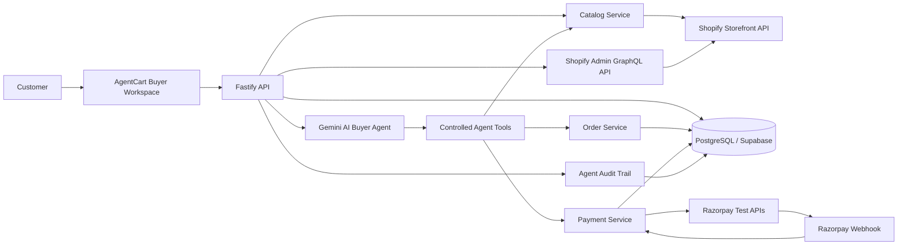

# AgentCart — AI Buyer Infrastructure for Agentic Commerce

> **Razorpay AI Builder Internship 2026 — Track 1: AI Growth & Agentic Commerce**  
> *"An AI that can actually buy from a merchant."*

---

## 🛍️ Overview

**AgentCart** turns natural-language shopping requests into real, auditable, end-to-end commerce transactions. 

Unlike traditional chatbot demos that produce text recommendations and send buyers away to browse external websites, AgentCart serves as the **authoritative commerce control layer**:

```
User Intent
    ↓
Gemini 3.5 AI Buyer Agent
    ↓
Shopify Catalog Discovery & Comparison
    ↓
Server-Side Stock & Price Validation
    ↓
Authoritative Order Creation
    ↓
Explicit Financial Approval (Approve ₹2,499)
    ↓
Razorpay Test Mode Checkout
    ↓
Cryptographically Verified Webhook (HMAC-SHA256)
    ↓
PostgreSQL Order Confirmed & Stock Decremented
    ↓
Observable Live Agent Trace & Merchant Growth Console
```

---

## 🏗️ Architecture



---

## ⚡ Tech Stack

| Layer | Technology |
|---|---|
| **Frontend** | Next.js 16 (App Router), React 19, Tailwind CSS, Lucide Icons, Recharts |
| **Backend** | Fastify, TypeScript, Zod Validation |
| **Database** | PostgreSQL, Prisma ORM |
| **AI Layer** | Google Gemini (Function Calling) |
| **Commerce API** | Shopify Storefront API + Shopify Admin GraphQL API |
| **Payments** | Razorpay Test APIs + Webhooks (HMAC-SHA256) |

---

## 🚀 Quickstart & Local Setup

### 1. Prerequisites
- Node.js `v20+` or `v24+`
- PostgreSQL running locally (e.g. `localhost:5432`)
- Google Gemini API Key & Razorpay Test Credentials

### 2. Clone & Install Dependencies
```bash
git clone https://github.com/rishikmanche/agentcart.git
cd agentcart
npm install
```

### 3. Configure Environment Variables
Copy `.env.example` to `.env`:
```bash
cp .env.example .env
```

Verify your `.env` contains:
```env
GEMINI_API_KEY="your-gemini-api-key"
GEMINI_MODEL="gemini-3.5-flash-lite"

SHOPIFY_STORE_DOMAIN="agentcart-demo.myshopify.com"
SHOPIFY_STOREFRONT_ACCESS_TOKEN="your-storefront-token"
SHOPIFY_ADMIN_ACCESS_TOKEN="your-admin-token"
SHOPIFY_API_VERSION="2026-07"

RAZORPAY_KEY_ID="rzp_test_xxxx"
RAZORPAY_KEY_SECRET="your-razorpay-secret"
RAZORPAY_WEBHOOK_SECRET="agentcart_webhook_secret_2026"

DATABASE_URL="postgresql://username@localhost:5432/agentcart"
MAX_ORDER_VALUE=5000
PORT=4000
HOST=0.0.0.0
```

### 4. Initialize Database & Seed Catalog
```bash
# Push Prisma schema to PostgreSQL
npm run prisma:migrate

# Seed Shopify demo catalog (Headphones, Keyboards, Smartwatches, Backpacks, Speakers, Accessories)
npm run shopify:seed
```

### 5. Start Development Servers
```bash
# Starts both Fastify Backend (Port 4000) and Next.js Frontend (Port 3000)
npm run dev
```

- **Buyer Workspace**: [http://localhost:3000](http://localhost:3000)
- **Merchant Console**: [http://localhost:3000/merchant](http://localhost:3000/merchant)
- **Interactive Swagger UI (Web)**: [http://localhost:3000/docs](http://localhost:3000/docs)
- **Fastify OpenAPI Explorer**: [http://localhost:4000/docs](http://localhost:4000/docs)
- **API Health Check**: [http://localhost:4000/health](http://localhost:4000/health)

---

## 🧪 Automated Verification Suite

Run the full end-to-end verification suite testing all 12 critical flows:
```bash
npm run test:e2e
```

Checks executed:
1. `GET /health` API connectivity.
2. `POST /catalog/seed` Idempotent catalog provisioning.
3. `GET /catalog/products` Authoritative product retrieval.
4. `POST /agent/message` Multi-turn Gemini Tool Calling (`search_products`, `compare_products`).
5. `POST /orders` Server-side 9-step order creation & stock verification.
6. `POST /payments/create` Razorpay Test Order creation.
7. `POST /webhooks/razorpay` Cryptographic HMAC-SHA256 signature verification.
8. Database state transitions (`Payment: CAPTURED`, `Order: CONFIRMED`).
9. Webhook idempotency (duplicate delivery safety).
10. Rejection of forged webhook signatures (HTTP 400).
11. `MAX_ORDER_VALUE` safety limit enforcement (> ₹5,000 blocked).
12. `GET /merchant/dashboard` Real commerce metrics & order audit trail.

---

## 🛡️ Safety & Money Rules

1. **Zero LLM Price/Stock Authority**: Gemini never dictates price, inventory, or payment status.
2. **Mandatory Explicit Approval**: Payments cannot be triggered without a dedicated user approval dialog showing the exact locked INR amount (e.g. `Approve ₹2,499`).
3. **Cryptographic Webhook Verification**: Orders are only confirmed upon receiving a valid, signed Razorpay webhook event.
4. **Idempotency Guard**: Repeat webhook events do not duplicate balance, order state, or stock deductions.
5. **Safety Limits**: All orders strictly enforce `MAX_ORDER_VALUE` (e.g. ₹5,000).

---

## 📊 Live Merchant Console

Located at `/merchant`, the Merchant Console tracks:
- **AI-Attributed Revenue**: Sum of real verified orders placed via AgentCart.
- **AI-Assisted Conversion Rate**: Discovery → Comparison → Checkout → Purchase.
- **Interactive Order Timeline**: Inspects the complete 7-step audit trail for any order directly from database telemetry.

---

## 📜 License
MIT © 2026 AgentCart Team.
